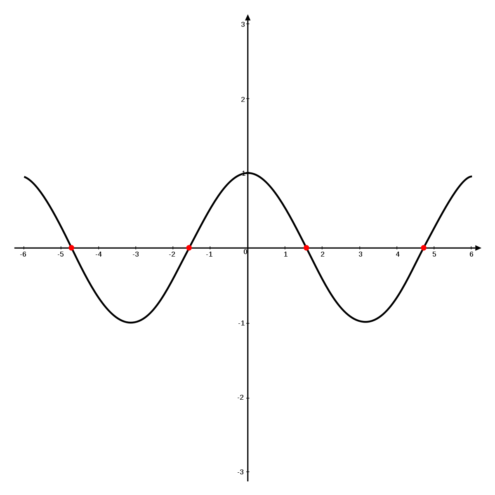
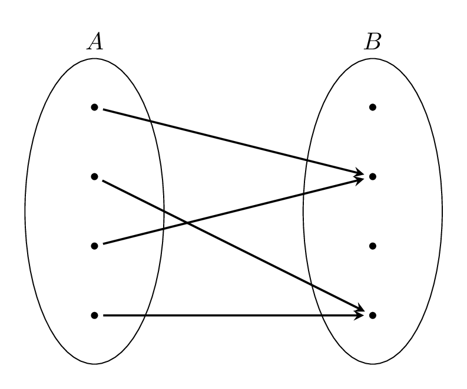
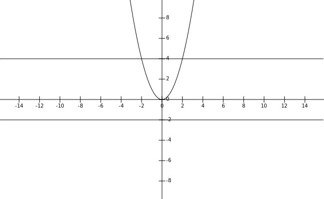

<!--Per esportare con sfondo bianco, rimuovere stile dalle foto-->

## Fondamenti matematici per l'informatica

#### To do
- vedere concetto di fibra di funzione.
- sistemare def 1.21

#### Link utili
- [Moodle](https://didatticaonline.unitn.it/dol/course/view.php?id=32432) (Lezioni registrate 2021)
- [Sito del corso](http://pignatelli.maths.unitn.it)
- [Appunti pdf](https://pignatelli.maths.unitn.it/didattica/fmi/Dispensa%20Luminati.pdf)

#### Esame
Scritto:
- 3/4 esercizi;
- domanda di teoria [(Lista di teoremi)](https://pignatelli.maths.unitn.it/didattica/fmi/lista-teoremi-2016-2017.pdf)

#### Obiettivi del corso
- Aritmetica modulare
- Crittografia RSA

## Teoria degli insiemi
Due concetti primitivi:
- elemento;
- insieme.

La teoria può essere sviluppata a partire dal concetto di **appartenenza**.  
x

A. x è un elemento di A.

La proprietà fondamentale che si richiede ad un insieme è la seguente: per ogni elemento x devo essere in grado di stabilire se x

A oppure

ad A.

##### Uguaglianza
Dati A e B due insiemi, A = B se e solo se per ogni x appartenente ad A, appartiene anche a B e viceversa.

##### Vuoto
L'insieme caratterizzato dal non avere elementi ($\emptyset$)

##### Implica
Siano P e Q due affermazioni. Q implica P <-> (P o (non Q))

Sempre lezione sugli insiemi. Vedere accenni sui pdf, ma al momento nulla di complesso. Ho avuto del problemi con latex, quindi niente appunti sugli insiemi, ma erano veramente due cagate.

#### Relazioni e funzioni
Siano X e Y due insiemi (anche vuoti). Un sottinsieme R di XxY (prodotto cartesiano) si dice **relazione** tra X e Y.  
Si scrive **x R y** (x è in R relazione con y) se x $\in$ X, y $\in$ Y e (x,y) $\in$ R.

Sia f una relazione tra X e Y, cioè $f$ è contenuto in XxY. $f$ si dice **funzione** da X a Y (o applicazione o mappa) se $\forall$ x $\in$ X, $\exists$ un unico y $\in$ Y t.c. x $f$ y.  
In questo caso scriviamo $f$: X $\rightarrow$ Y e si dice che X è il **dominio** di $f$, mentre Y **codominio**.  

*Formalmente una funzione è una tripla (x, y, f) (da dove parto, dove arrivo e come ci vado), dove X e Y sono due insiemi, $f$ è una realzione tra X e Y*

##### Funzione come legge
Siano X e Y due inisiemi non vuoti. Una funzione $f_{(legge)}$: X $\rightarrow$ Y (come legge, visto come concetto priitio) è una legge che ad ogni x $\in$ X associa un unico elemento y $\in$ Y.

##### Notazione
Dati X e Y due insiemi (anche vuoti), determiniamo l'insieme **$Y^X$** l'insieme i cui elementi sono tutte e sole le funzioni del tipo $f: X \rightarrow Y$.  
$Y^X = \{f\in 2^{X\times Y} | (\forall x \in X, \exists \: ! \: y \: t.c \: (x, y) \in f)\}$

##### Insieme delle parti
Dato un insieme A, indichiamo con $2^A$ o P(A) l'insieme i cui elementi sono tutti i sottinsiemi di A, detto l'insieme delle parti di A. (Vedi <a href="Probabilità e statistica.md">statisica</a>).

###### Esercizio
Dato un insieme X (qualsiasi), calcolare $X^\emptyset$ e $\emptyset^X$. Suggerimento: Qui le funzioni sono delle relazioni.

##### Definizione di composizione
Consideriamo 3 insiemii non vuoti (X, Y, Z) e $f: X\rightarrow Y$ e $g: Y \rightarrow Z$.  
$g \: o \: f$ (f composto g): $f: X \rightarrow Z$.  
($g \: o \: f)(x):=g(f(x))$

##### Immagine e controimmagine
Siano X e Y due insiemi non vuoti e $f: X\rightarrow Y$ una funzione.  
Dato A sottinsieme di X (A $\in$ X), definiamo l'immagine di Atramite f come segue:
$$
f(A):=\{y \in Y \: | \: \exists x \in A \: t.c. y=f(x)\}
$$
$f(x)$ si dice **immagine** di $f$.

Dato B $\subset$ Y, determiniamo la **controimmagine** di B tramine $f$ ponendo:
$$
f^{-1}(B):=\{x\in X | f(x) \in B\}
$$

 

Se B si riduce ad un solo punto, allora la controimmagine di quel punto si dice **fibra** di $f$ sopra y
$$
f^{-1}(y) = f^{-1}(\{y\})=\{x \in X \: | \: f(x) = y\}
$$

###### Altre definizioni
Dato $f:X\rightarrow Y$, si dice che:
- $f$ è **iniettiva** se $\forall x_1, x_2 \in X t.c. x_1\neq x_2, f(x_1) \neq f(x_2)$. Le fibre tutto vuote o singole.
- $f$ è **surgettiva** (o suriettiva) se $f(x) = y \forall y \in Y \exists x \in X t.c f(x) = y$. Le fibre sono tutte non vuote;
- $f$ è **bigettiva** (o biettiva) se è iniettiva e suriettiva. Le fibre sono tutte singole.

*Il precedente grafico mostra una funzione non suriettiva ($y=-2$) e non iniettiva ($y=4$)*

###### Esercizio
$R$ = insieme numeri reali, $R^+$ = {insieme numeri reali $\>= 0$}
- $f_1: R \rightarrow R$
- $f_2: R \rightarrow R_+$
- $f_3: R_+ \rightarrow R$

Sono tutte distine, cambia dominio e codominio
<table>
  <tr>
    <td></td>
    <td>f1</td>
    <td>f2</td>
    <td>f3</td>
  </tr>
  <tr>
    <td>Iniettiva</td>
    <td></td>
    <td></td>
    <td>X</td>
  <tr>
  <tr>
    <td>Suriettiva</td>
    <td></td>
    <td>X</td>
    <td></td>
  <tr>
  <tr>
    <td>Biettiva</td>
    <td>X</td>
    <td></td>
    <td></td>
  </tr>
</table>
Da complementare

Sia $f: X\rightarrow Y$ una funzione bigettiva tra insiemi non vuoti. Allora esiste ed è unica una funzione $g: Y\rightarrow X$.
$$
g \: o f = id_x \: f o g = id_y
$$
In questo caso g si dice inversa di $f$. (Vedi 1.21, niente di complesso)

###### Esercizio 14 p.4
Sia x un insieme. Calcolare $\emptyset ^x$ e $x^\emptyset$

Sol:
- $x^\emptyset$ (dal vuoto a x) = $\{f \in 2^{\emptyset*x} = 2^\emptyset = \{\emptyset\}|\forall x \in \emptyset, \exists!y\in x
X t.c. (x,y)\in f\} = \{\emptyset\}$ Una funzione dal vuoto in x è la funzione vuoto

- $\emptyset ^x$ = $\{\emptyset\}$ se $x=\emptyset$, $\emptyset$ se X $\neq \emptyset$, perchè:

Sia X un insieme $\neq \emptyset$. Vale. $\emptyset^x = \{\in 2^{X*\emptyset} = 2^\emptyset = \{\emptyset\}|\forall x \in X, \exists!y\in \emptyset t.c (x,y) \in f = \emptyset\}= \emptyset$

###### Esercizio 1.10 p.5
Siano X, Y e Z tre insiemi e siano $f: X\rightarrow Y$ e $g: Y \rightarrow Z$ due funzioni.

X $\rightarrow f \rightarrow$ Y $\rightarrow g \rightarrow$ Z
1. $f, g$ iniettive $\Rightarrow$ $g$ o $f$ è iniettiva;
2. $f, g$ surgettiva $\Rightarrow$ $g$ o $f$ è surgettiva;
3. $f, g$ bugettiva $\Rightarrow$ $g$ o $f$ è bigettiva;
4. $f$ bigettiva $\Rightarrow$ $f^{-1}$ bigettiva

**Iniettività, f e g iniettive**  
Siano $x_1, x_2 \in X$ t.c $x_1 \neq x_2$.  
Dunque, $f(x_1) \neq f(x_2)$ in quanto $f$ è iniettiva.  
Dunque, $g(f(x_1)) \neq g(f(x_2))$ in quanto anche $g$ è iniettiva. $g(f(x_1))$ = $f$ o $g$ $(x_1)$

L'iniettività è mantenuta nella composizione

**Surettività, f e g surgettive**  
Sia $z \in Z$. Poiché $g$ è surgettiva $\exists$ (almeno) $y \in Y t.c. g(y)=z$. Anche $f$ è surgettiva, dunque $\exists x \in X t.c f(x)=y$. Vale: $(g o f)(x) = g(f(x))=g(y)=z$

La surgettività è mantenuta nella composizione

###### Esercizio 1.11 e 1.12 (ci sono due errori, quali?) per casa (soluzione negli appunti Moodle)

###### Insiemi equipotenti e cardinalità (cenni)
Dati due iniemi X e Y, diciamo che X è equipotente a Y (o X ha la stessa cardinalità di Y) se esiste una bigezione (funzione bigettiva) $f: X\rightarrow Y$. In questo caso scriveremo: X~Y (~ $\rightarrow$ è equipotente a).

Siano X, Y e Z tre insiemi. Valgono:
1. X ~ X. X idx X identità è sempre una bigezione
2. X ~ Y $\Rightarrow$ Y ~ X. X ~ Y $/Rightleftarrow X \rightarrow^{\exists f_\tilde}$. sistemare
3. X ~ Y, Y ~ Z $\Rightarrow$ X ~ Z

#### Insieme cardinale
Associa ad ogni insieme X un insieme |X| detto insieme cardinale X in modo che:
- X ~ |X|
- due insiemi cardinali distinti non sono equipotenti

###### Teorema
Siano X e Y due insiemi. Allora X ~ Y se e solo se |X| = |Y|. Deve avere la stessa cardinalità.

## Induzione (sicuro in esame)
*Nell'esame si deve capire l'esplicitazione del teorema (ipotesi e tesi).*

###### Assioma di Peano (per costruire l'insieme dei numeri naturali)
**Assioma 2.5** 0 (al momento privo di significato) $\in N$, esistenza di un elemento  
**Assioma 2.6** $\exists$ succ: $N\rightarrow N$ è iniettiva (funz. successivo)  
**Assioma 2.7** succ($N$) $\subset N$ \ {0}. Ovvero $\forall n \in N$, succ(n) $\neq$ 0.  
**Assioma 2.8 (di induzione)** Sia A un sottinsieme di $N$. Supponiamo che:
1. 0 $\in$ A (Base dell'induzione)
2. $\forall n \in N: (n \in A \Rightarrow$ succ($n$) $\in$ A) ovvero se $n \in$ A allora anche succ($n$) $\in$ A (**Passo induttivo**)

Allora A = N

*Noi non sapremo che n sta in A, faremo finta. Se n non apparteine ad A, non devo diostrare nulla, altrimenti devo dimostrare succ($n$) $\in$ A. Noi faremo finta che sia vero.*

###### Esercizio
**Proposizione 2.9** Per ogni n $n \in N$ \ {0}, esiste un unico n $\in N$ perchè iniettiva.

#### Teorema. Principio di induzione di prima forma
Sia $\lt P(n) \gt _ {n\in N}$ una famiglia di proposizioni (ossia affermazioni) inidcizzate su $N$. Supponiamo che:
1. Base induttiva sia vera.
2. Passo induttivo $\forall n \in N: (P(n)$ (ipotsi induttiva) $\Rightarrow$ (passo induttivo) $P(succ(n)))$

Allora $P(n)$ è vera per ogni $n \in N$.

###### Dimostrazione
Definiamo $A:=\{n \in N | P(n)$ è vera $\}$. Vogliamo dimostrare che A = N.  
Grazie ad (1), vale che 0 $\in$ A perchè P(0) è vera.  
Sia n $\in$ A. Vale: $n \in A \Leftrightarrow P(n)$ è vera $\Rightarrow ^{(2)} P($ succ(n)) è vera $\Leftrightarrow$ succ(n) $\in$ A.

Abbiamo dimostrato che 0 $\in$ A;  
Se n $\in$ A, allora succ(n) $\in$ A.  
Grazie all'assioma 2.8 di induzione, vale che A = N.

##### Teorema di Ricorsione
Sia X un insieme non vuoto, sia $h: NxX \rightarrow X$ una funzione e sia $c \in X$. Esiste ed è unica funzione $f: N \rightarrow X$ t.c.
1. $f(0)=c$
2. $\forall n \in N, f(succ(n)) = h(n, f(n))$

##### Applicazione del teorema di ricorsione
Sia $m \in N$.  
Definiamo la funzione "somma a sinistra con $m$" = "$N \ni n \rightarrow m+n \in N$" ($f(n)=m+n$).  
Poniamo $X:=N$, $h:N\times N$ e $c:=m$. Applichiamo il teorema di ricorsione con i dati X, h e precedenti. Otteniamo, quindi, una sola funzione $f: N \rightarrow N$ t.c.
$$
\begin{cases}
  f(0) = m \\
  f(succ(n)) = h(n, f(n)) = succ(f(n)) \:\:\:\:\: \forall n \in N
\end{cases}
$$

Se indichiamo questa funzione $f: N \rightarrow N$ con il simbolo usuale $m+.:N \rightarrow N$, ovvero $f(n) = m+n$, allora:
$$
\begin{cases}
  m+0=0 \\
  m+succ(n) = succ(m+n) \forall n \in N
\end{cases}
$$

Definiamo il "prodotto a sinistra con m", ovvero "$N \ni n \rightarrow m \cdot n \in N$".  
Definiamo $X:=N, c:=0, h: N\times N \rightarrow N$. Applichiamo il teorema di ricorsione con i dati precedente, ottenendo una sola funzione $f:N \rightarrow N$ t.c.
$$
\begin{cases}
f(0) = 0 \\
f(succ(n)) = h(n,f(n)) = m+f(n) \:\:\:\:\: \forall n \in N
\end{cases}
$$

Se indichiamo $f:N \rightarrow N$ con il simbolo usuale $m \cdot :=N \rightarrow N$ (ovver $f(n) = m\cdot n = mn$), allora:
$$
\begin{cases}
m 0 = 0 \\
m succ(n) = m+mn \:\:\:\: \forall n \in N
\end{cases}
$$

###### Osservazione
Sia $n \in N$. Vale:
$$
n+1 = n + succ(0) = ^{(2\: somma)} \\ = succ(n+0) = ^{(1)\: somma} = succ(n)
$$

#### Ordinamento totale dei naturali
Sia X un insieme non vuoto e sia R una relazione binaria su X (ovvero R $\subset$ X $\times$ X). Tale relazione R si dice **ordinamento parziale di X** se soddisfa le seguenti proposizioni:
1. x R x $\forall x \in X$ (proposizione riflessiva) (x R x significa che (x,x) $\in$ R).
2. (x R y) e (y R x) $\Rightarrow$ x = y (proposizione antisimmetrica), $\forall$ x, y $\in$ X.
3. (x R y) e (y R z) $\Rightarrow$ x R z (proposizione transitiva).

Se in aggiunta a queste 3 prop vale anche:  
4. $\forall x,y \in X$, x R y è vera oppure y R x è vera (tricotomia) allora si dice che R è un **ordinamento totale** di X

#### Teorema di induzione "shiftato" di prima forma
Sia $\lt P(n) \gt _{n \geq K}$ una famiglia di proposzioni indiciziazzta sui numeri naturali n $\geq$ k. Supponiamo che valgano le seguenti due proposizioni:
1. Base induttiva P(k) è vera.
2. Passo induttivo $\forall n \geq k: (P(n) \Rightarrow P(n+1))$, cioè se P(n) è vera, allora anche P(n+1) è vera.  
Allora P(n) è vera $\forall n \geq k$

##### Esercizio
Siano X e Y due insiemi non vuoti e $f: X \rightarrow Y$ una funzione. Consideriamo {$A_i$} una famiglia di sottinsiemi di X.  
Si dimostri che se faccio l'intersezione di tutti gli insiemi  vedi su moodle

#### Induzioni esercizi esame
##### Principio di induzione "shiftato"

Sia h $\in N$ e sia {$P(n)$} $_{n\geq h}$

Supponimo che:
1. La **base dell'induzione** P(h) è vera.
2. Il **passo induttivo** $\forall$ n $\geq$ h. Se P(n) è vera, devo dimostrare ceh P(n+1) è vera.

Allora P(n) è vera $\forall$ n $\geq$ h

#### Appello 11 febbraio 2016
Si mostri per induzione su n $\geq$ 1 la seguente uguaglianza
$$
\sum_{k=1} ^ n \frac {k}{2^k} = 2 -\frac{n+2}{2^n}
$$

###### Prima soluzione, versione estesa
Sia h=1 e per ogni n $\geq$ di h P(n):=$(\sum^n_{k=1} n \frac {k}{2^k} = 2 -\frac{n+2}{2^n})$

Verifichiamo la condizione 1 del teorema, cioè la base dell'induzione. Ovvero che P(1) è vera.
$P(1) = \sum ^n _{h=1} \frac{k}{2^k} = 2 - \frac{3}{2} \rightarrow \frac{1}{2} = \frac{1}{2}$  
Dunque un mezzo uguale un mezzo implica che P(1) è vera e la base è verificata.

Verifichiamo la condizione 2, cioè il passo induttivo, ovvero: assumiamo che la P(n) sia vera.
$$
\sum ^n _{k=1} \frac{k}{2^k} = 2-\frac{n+2}{2^n}
$$

assumendo questo dimostriamo che vale P(n+1), ovvero
$$
\sum ^{n+1} _{k=1} \frac{k}{2^k} = 2-\frac{n+1+2}{2^{n+1}}
$$

Questa è la tesi del passo induttivo (non vero nome, non necessario).

*Faccio finta la prima sia vera e dimostro l'altra*

Primo metodo:
Scegliere uno dei deu termini dell'uguaglianza e cercare di mettere in evidenza uno dei due membri della tesi

$\sum ^n _{k=1} \frac{k}{2^k} = (\sum ^n _{k=1} \frac{k}{2^k}) + \frac{n+1}{2^{n+1}}$

Passaggi vari da Recuperare

Il passo induttivo è verificato. 
