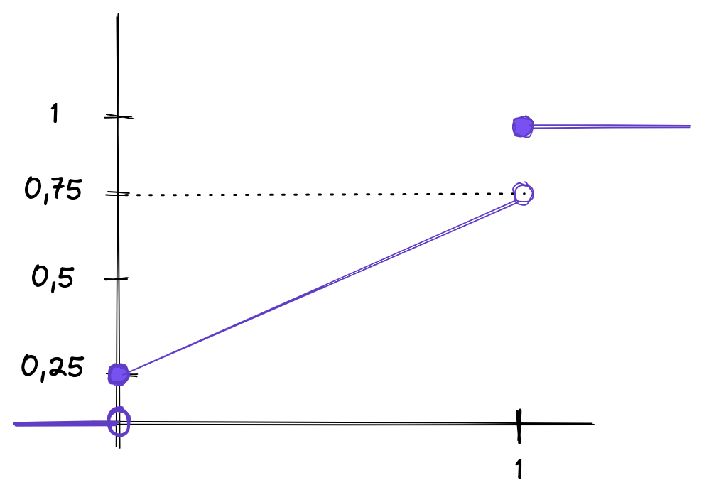

## Probabilità e statistica

#### To do / cose da fare
- tra due settimane primo parziale
- sistemare appunti e studiare (vedi esercizi pdf)

#### <a href="http://datascience.maths.unitn.it/~claudio/teaching/ps/2021/">Sito del corso</a>
- user: PS2021
- password: Kolmogorov2021
- [pdf]("http://datascience.maths.unitn.it/~claudio/teaching/ps/2021/probabilita-dispensa.pdf")
- <a href="http://datascience.maths.unitn.it/ps">Esercizi giornalieri</a>;

#### Esame
- 1h e 30min
- 10 domande a risposta multipla sulla parte di teoria
- 3 esercizi
- ci sono molti parziali

#### Libro di testo
- *Probabilità e statistca* di Ross

#### Programma del corso
- Introduzione alla probabilità
- Assiomi della probabilità
- Probabilità condizionate e indipendenti
- Varibili alitorie
- Teoremi limite
- Statistica inferenza

<hr>

#### Introduzione
##### Esempio
Una scatola di O-ring contiene:
- 30 di diametro 10mm;
- 30 di diametro 9mm;
- 30 di diametro 11mm;

Apriamo una scatola ed estriamo un O-ring. Qual è la probilità che estriamo un O-ring del diametro di 10mm?<br>
La probabiiltà è soggettiva.
- scelgo senza guardare, e senza sleezionare attraverso il tatto, il primo O-ring con cui vengo in contatto;
```
Pr(estrarre un O-ring dle diametro di 10mm) = 30/90 (casi favorevoli/casi totali)= 1/3
```
- rovescio la scatola sul tavolo e considero l'utllimo O-ring che tocca il piano d'appoggio;
```
Come sopra
```
- analizzo accuratamente di O-ting prima di sceglierlo in modo che sia di 10mm;
```
Seguendo le indicazioni del docente Pr("estrarre O-ring 10mm") = 1
```

- estraggo senza guardare un O-Ring alla volta e mi fermo quando penso di aver trovato un O-Ring del diametro di 10mm;
```
Estremamente soggettivo
```

<br>

##### Esperimento aleatorio
Un esperimento di dice aleatorio per un certo individuo, in un certo istante, se l'individuo non è ancora in grado di indicarne con sicurezza il risultato (indipendentemente se l'esprimento è già avventu oppure no).

##### Esito o evento elementare
Un possibile risultato del nostro esperimento aleatorio. Gli eventi elementari sono tra loro incompatibili (o succede uno o succede l'altro, no contemporaneamente).

##### Spazio campionario
E' la collezione di tutti gli eventi elementari. Lo indicheremo con in simbolo Omega (**Ω**)
- Gli elementi di Ω sono a due a due incompatibili
- Sono esaustivi

###### Esempio 1:
Immaginiamo una scatola contente tre palline: una bianca, una verde e una rossa. Mescolo ed estraggo senza guardare (esperiemento aleatorio). Le palline sono tutte uguali, per tutte le caratteristiche, tranne per il colore.

Gli eventi aleatori sono:
- Verde={""è uscita una pallina di colore verde"};
- Rosso={"è uscita una pallina di colore rossa"};
- Bianca={"è uscita una pallina di colore bianca"}.
<br><br>
- Ω = {Verde, Bianco, Rosso}.

###### Esempio 2:
Lancio si un dado a 6 facce da 1 a 6. Gli eventi aletori sono {1}, {2}, {3}, {4}, {5}, {6}. <br>
Ω = {1, 2, 3, 4, 5, 6}.
Svolgo l'esperimento:
- esce il numero 1 : A1 = {1}
- esce un numero pari : A2 = {2, 4, 6}
- esce un numero più piccolo di 3 : A3 = {1, 2}
- esce un numero primo : A4 = {1, 2, 3, 5}

Questi sono esempi di eventi

###### Esempio 3:
Lancio di due dadi con 6 facce. <br>
Evento elementari: {i, j}  i, j = 1, ..., 6 (tutte le possibile coppie ordinate)

Esperimento 1: Lancio di un dado. Ω1 = {1, ..., 6}<br>
Esperiemnto 2: Lancio di un altro dado. Ω2 = {1, ..., 6} <br>
Ω = Ω1 x Ω2 (prodotto cartesiano).

A = {"almeno una faccia è pari"} = {(1,2), (2,3), ..., (6,6)}

B1 = {"solo la primo risultato è pari"} = {(2,1), (2,3), (2,5), (4,1), ... (6,5)}<br>
B2 = {"solo il secondo risultato è pari"} = {(1,2), (1,4), ..., (5,6)}<br>
B3 = {"entrambi i risultati sono pari"} = {(2,2), (2, 4), ..., (6,6)}

A = B1 $\cup$ B2 $\cup$ B3


##### Insiemi disgiunti
Dati due insiemi $A$, $B$ appartenenti a Ω, sono disgiutni se A intersecato B = insieme vuoto (sono incompatibili). Nell'esempio di prima B1 e B2 sono disgiunti.

##### Leggi di De Morgan

Innanzitutto definiamo l'insieme complementare. Dato un insieme $A \in E$ sott'insieme di un insieme universo $E$, fanno parte del complementare di $A$ tutti quegli elementi che appartengono ad E, ma non ad E. Questo insieme si indica con $A^c$. Riassumendo:
$$
A^C:=\{x\in E\ |\ x\notin A\}
$$

Le leggi di De Morgan affermano che:
- $(A \cup B)^c = A^c \cap B^c$
- $(A \cap B)^c = A^c \cup B^c$
- $A^{c^{c}}$ = $A$

<br>

##### Insieme delle parti
L'insieme delle parti (insieme potenza) P($\Omega$) è la collezione di tutti i sottoinsiemi di $\Omega$. Indichiamo con $\#\Omega$ la cardinalità di $\Omega$. <br>
Se $\Omega$ è definito, allora $\#P(\Omega) = 2^{\#\Omega}$

$\Omega$ = {1, 2, 3};<br>
P($\Omega$) = {$\emptyset$, {1}, {2}, {3}, {1,2}, {1,3}, {2,3}, {1,2,3}}

$\#\Omega$ = 3 <br>
$\#P(\Omega)$ = $2^{\#\Omega}$ = $2^3$ = 8

##### Tribù o $\sigma$ (sigma) algebra
Consideriamo uno spazio campionario $\Omega$. <br>
Una classe $A$ di parti (sottoinsiemi) di $\Omega$ si dice tribù se ha i seguenti requisiti:
1. $\Omega$ deve appartenere alla classe: $\Omega \in A$
2. Se A $\in A$ allora $A^c \in A$
3. Se $\{A_i\}^\inf_{i=1}$ tale che $A_i \in A \forall i$, allora $U^\inf_{i=1} A_i \in A$

##### Algebra
La definizione è la stessa tranne che: <br>
- (3') Se $\{A_i\}^n_{i=1}$ tale che $A_i \in A \forall i$, allora $U^n_{i=1} A_i \in A$

La tribù è sempre anche un algebra.

##### Evento
Dato uno spazio campionario $\Omega$ e una sua tribù $A$ chiameremo evento un qualsiasi evento di $A$.

###### Esercizio
Dato $A$ (tribù o algebra) di $\Omega$, allora dimostrare che $\emptyset \in A$.
- $\emptyset = \Omega ^c$
- $\Omega \in A$ per 1
- $\emptyset = \Omega ^c \in A$ per 2

###### Esercizio PER CASA
Mostrare che dato un insieme **finito** $\Omega$ in algebra $A$ di $\Omega$ e insiemi *** tali che $A_i \in A \forall i = 1,...,n$ allora *** (Uso de morgan)

###### Esercizio
Data una tribù $A$ di $\Omega$ e A,B $\in A$ allora A intersecato B $\in A$ <br>
$A \cap B = A^c \cup B^c$

###### Esercizio con Teorema
Date due Algebre $A_1$ e $A_2$ di $\Omega$, allora $A_1 intesrecato A_2$ è un algebra di $\Omega$ <br>
Dimostrazione:
- $\Omega \in A_1$, $\Omega \in A_2$, allora $\Omega \in A$
- A $\in A_1$, A $\in A_2$, allora $A^c \in A_1, A^c \in A_2$ quindi A$^c \in A$ (2)
- A, B $\in A_1$, A,B $\in A_2$ allora A unito B $\in A_1$, A unito B $\in A_2$, quindi A unito B $\in A$ (3)

Lo stesso risultato vale anche per una Tribù.

###### Esempio
$\Omega$ = {1, 2, 3} <br>
$A_1$ = {$\emptyset, \Omega$, {1},{2,3}} <br>
$A_2$ = {$\emptyset, \Omega$, {2},{1,3}}

$A = A_1 unito A_2$ = {$\emptyset, \Omega$, {1},{2},{2,3},{1,3}}. Non è un'algebra perchè se prendo un elemento qualsiasi non da $\Omega$ e un'algebra deve'essere esprimibile con la potenza del 2.

###### Esempio
{A c= $\Omega$: A è un insieme finito} è un'algebra?<br>
No. Ad esempio quando $\Omega$ è numerabile, cioè quando la cardinalità di omega è numerabile, quindi non ci sarebbe la orima proprità. Se $\Omega$ sono i numeri naturali non è finito e non appartiene alla classe.

Tribù generata da una famiglia di Insiemi
Consideriamo una famiglia $f$ di sottinsiemi di $\Omega$. Chiamiamo Ma $A_f$ la tribù generata da $f$:
$$
A_f \subseteq {A: A \label{marker} % è una tribù e fc=A}
$$

##### Spazio Probabilizzabile
Dato uno spazio $\Omega$ e una tribù $A$ di $\Omega$, chiameremo la coppia ($\Omega, A$) spazio probabilizzabile.

###### Esempio
- $\Omega$ = {0,1} (testa o croce)<br>
- $A_1$ = {$\emptyset$, {0},{1},$\Omega$} <br>
- $A_2$ = {$\emptyset, \Omega$}

Quindi possiamo costruire due spazi probabilizzabili:
- ($\Omega, A_1$)
- ($\Omega, A_2$)

###### Esempio
$\Omega$ = {1,2,3,4,5,6} <br>
- $A_1$ = P($\Omega$)
- $A_2$ = {$\emptyset, \Omega$}
- $A_3$ = {\emptyset, {1}, {2,3,4,5,6}, $\Omega$}

##### Probabilità (Definizione assiomatica di Kolmogorov)
Dato uno spazio probabilizzabile ($\Omega, A$) una misura di probabilità (o semplicemente una probabilità) $P_r$ è un'applicazione (o mappa) $P_r$ : $A \Rightarrow R^+$ tale che:
1. assioma di non negatività: se A $\in A$ allora $P_r(A) \geq 0$.
2. assioma di normalizzazione: $P_r(\Omega) = 1$
3. assioma di sigma addittività ($\sigma$ addittività) e va a braccetto con la terza proprietà di una collezione per essere una tribù: $\{A_i\}^\inf_{i=1}$ tale che A $_i \in A$e a due a due disgiunti $A_i \cap A_j = \emptyset \forall i,j\:\:i\neq j$ allora
$$
Formulone
$$
3. ' (assioma di addittività): se $\{A_i\}^n_{i=1}$ tale che A $_i \in$ A, A $_i \cap $ A $_j$ = $\emptyset$ $\forall i,j$ $i\neq j$, allora:
$$
Formulone
$$

##### Spazio Probabilià
Dato $\Omega$, una tribù $A$ di $\Omega$ e una misura di probabiiltà sullo spazio probabilizzabile ()$\Omega, A$), chiameremo la terna ($\Omega, A, P_r$) uno **spazio probabilizzato** o spazio di probaibilità o spazio di Kolmogorov.

###### Esempio
$\Omega$ = {1,2,3,4,5,6} (lancio di un dado) <br>
$A = P(\Omega)$ <br>
$\#\Omega = 6$ $\#A = 2^6$ <br>
($\Omega, A$) spazio probabilizzabile

$P_r({1}) = P_r({2}) = P_r({3}) = P_r({4}) = P_r({5}) = P_r({6})$


1 = $P_r(\Omega) = P_r({1,2,3,4,5,6}) = P_r{{1} \cup {2} \cup  {3} \cup  {4} \cup  {5} \cup  {6}}$ = somma delle probabilità $=^{(3)} \sum^6_{i=1}P_r(\{i\}) = \sum^6 ...$

A = {2,4,6} $\in A$ <br>
$P_r(A) = P_r({2,4,6}) = P_r({2} \cup {4} \cup {6}) = ^{(3)}\\P_r({2})+P-r({4})+P_r({6}) = 3p = 3*1/6 = 1/2$

Dato A $\in A$ allora $P_r(A) = \frac{\#A}{\#\Omega} = \frac{\#A}{6}$

###### Esempio

Tiro freccetta.
- La freccetta prende sempre il tabellone
- la probabilità è proporzionale all'area della corona.

$\Omega$ = {1,2,3} <br>
$f$ = {{1},{2},{3}}

$A_f$ (calcolare per casa)

($\Omega, A_f$) spazio probabilizzato

#### Regole del calcolo
- Regola 1. Se A è un evento con probabilità $P_r$(A) allora $P_r(A^c)$ = 1-$P_r$(A) (probabilità che non si verifichi). <br>
$\Omega = A \cup A^c$ e $\emptyset = A \cap A^c$
<br><br>
*(3) abbiamo $P_r(\Omega) = P_r(A \cup  A^c)=P_r(A)+Pr(A^c)$* <br>
*(2) abbiamo $P_r(\Omega) = 1$*
$$
1 = P_r(A)+P_r(A^c) \Leftrightarrow P_r(A^c) = 1-P_r(A)
$$

*Nota: $\emptyset = \Omega ^c$* allora P_r(\emptyset) = 1-P(\Omega) = 0

- regola 2. Se A e B sono fue eventi allora $P_r(A \cup B) = P_r(A)+P_r(B)-P_r(A \cap B)$ <br>
$A \cup B = A \cup (B \cap A^c)$ <br>
$A \cap (B \cap A^c) = \emptyset$
<br><br>
*(3) $P_r(A \cup B) = P_r(A)+P_r(B \cap A^c)$*
*(3) P_r(B) = P(A \cap B) + P_r(B \cap A^c)*

$$
P_r(A \cup B) = P_r(A)-P_r(A \cap B) + P_r(B)
$$

- regola 3. Se A $\subseteq B$ allora $P_r(A) \leq P_r(B)$ <br>
$B = (A \cap B) \cup (B \cap A^c) = \rightarrow ^ {A \subseteq B} =$ A \cup (B \cap A^c) <br>
Manca formula qua

*Nota: la regola 3 implica che $P_r(A) \leq 1 (P_r(\Omega))$ per ogni evento di A $\subseteq \Omega$*

*Nota: Se due eventi A e B sono equivalenti $A \subseteq B$ e $B \subseteq A$ allora $P_r(A) = P_r(B)$*

- regola 4. Disuguaglianza di Bonferroni <br>
Se $A_1, A_2, ..., A_n$, n eventi allora <br>
**Formula anche qua**

<hr>

Costruzione di una probabiiltà in uno spazio probabilizzabile dove $\Omega$ al più numerabile.
$$
\Omega = \{\omega_1, \omega_2, ...\} = \{\omega_i\}^\inf_{i=1}
$$

Ad ogni $\omega_i \in \Omega$ assegno un peso p({\omega_i}) i = 1, ...

*(i) p({$\omega_i$}) $\leq 0$*... ... ... ...*(ii) $\sum^\inf_{i=1}p(\{\omega_i\}) = 1$*

La probabilità di un evento A è data da:
$$
P_r(A) = P_r(U_{\omega_i \in A}\{\omega_i\})= \sum^\infty_{\omega_i \in A}P_r(\{\omega_i\}) =\sum^\infty_{\omega_i \in A}p(\{\omega_i\})
$$

$$
\Omega = U^infty_{i=1} \omega_i \:\:\:\:\:\: 1 = P_r(\Omega) Da finire
$$

Quindi non è possibile in uno spazio non finito che gli eventi elementari abbiano tutti la stessa probabilità.

###### Esempio
$\Omega = \{0,1,2,...\} \:\:\:\:\:\: A = p(\Omega)$ <br>
$P_r(\{n\}) = \frac{1}{2^{n+1}}$ è la probabilità di osservare n croci in una moneta equilibrata.

Calcolare la probabilità che {n è un numero pari (anche lo 0)}

{n è pari} = {0, 2, 4, 6} = {0} $\cup$ {2} $\cup$ {4} $\cup$ {6} $\cup$ ... <br>
L'evento complementare è {n è dispari} = {1,3,5,7,...}

$P_r$({n è dispari}) = $P_r$({1}) + $P_r$({3}) + $P_r$({5}) = $\frac{1}{2^2} + \frac{1}{2^4} + \frac{1}{2^6} + ... = \sum^\infty_{i=1}(\frac{1}{4})^i = \frac{1}{1-9}-1=\frac{4}{3}-1=\frac{1}{3}$

$P_r$({n è pari}) = 1-$P_r$({n è pari è dispari}) = $1-\frac{1}{3}=\frac{2}{3}$


######Prodotto di spazi campionari e Prodotto di tribù
Data una famiglia qualsiasi di spazi probabilizzabili $\{(\Omega_i, A_i)\}_{i \in I}$ allora possiamom costruire uno spazio prodotto probabilizzabile <br>
$\Omega = x_{i \in I}\Omega_i$ ottenuto come prodotto cartesiano (spazio campionario prodotto) <br>
$A = \otimes_{i \in I}A_i$ **Tribù prodotto**

Consideriamo A $_i \in A_i$ tali che $A_i \neq \Omega_i$ al più per un numero finito di indici e otteniamo $\prod_{i\in I} A_i$. Questo è un "rettangolo" e ($\Omega, A$) è uno spazio probabilizzato.

Supponiamo ora che per ogni spazio ($\Omega_i, A_i, P_{ri}$) sia probabilizzato

###### Esempio lancio di due monete equilibrate
- Prima moneta $\Omega_1 = \{T, C\} \:\:\:\:\: A_1 = \{\emptyset, \{T\}, \{c\}, \Omega\}$
- Seconda moneta $\Omega_2 = \{T, C\} \:\:\:\:\: A_2 = A_1$

Testo eserczio da vedere.

<hr>

Assumiamo che i due esperimenti aleatori non si influemzino. Allora possiamo costruire la provavilut. su ($\Omega, A$) a partire da $P_{r1}$ e $P_{r2}$ come una probaibilità prodotto
$$
P_r((\omega_1, \omega_2)) = P_r(\omega1) * P_r(\omega_2)
$$

$P_r(\omega_1)$ = $\frac{1}{2}$ se $\omega_1 = T, \frac{1}{2}$ se $\omega_1 = C$
formula

######Esercizio delle signore 14 p.31:
Scriviamo lo spazio campionario:

$\Omega$ = {{s, s, s}, {s, s, n}, ..., {n, n, n}} <br>
$\Omega_1 =$ {S,N} $\:\:\:\: \Omega_2 =$ {S,N} $\:\:\:\: \Omega_3 =$ {S,N} <br>
$\Omega = \Omega_1 \times \Omega_2 \times \Omega_3 \:\:\:$ $A = p(\Omega)$

$E_1$ = {"Almeno due signore usano in prodotto"} = {{s,s,n},{s,s,s},{s,n,s},{n,s,s}} <br>
$E_2$ = {"Alla seconda signora piace il prodotto"} = {\*,s,\*}

######Esercizio

Se uno spazio $\Omega$ ci sono due sott'insiemi A e B

$P_r(A^c) = 0.3, \:\:\:\:\:\: P_r(B)=0.4, \:\:\:\:\:\: P_r(A \cap B^c)=0.5$

- $\Omega = \{A \cap B, A^c \cap B^c, A \cap B^c, A^c \cap B^c\}$

$A = P(\Omega)$ (tribù)

- $P_r(A) = 1-P_r(A^c) = 0.7$

- $P_r(A \cap B) = P_r(A/A\cap B^c) P_r(A)-P_r(A \cap B^c) = \\ = 0.7-0.5$
- $P_r(A^c \cap B) = P_r(B)-P_r(A \cap B) = 0,4-0,2 = 0,2$
- $P_r(A^c \cap B^c) = 1-P_r((A^c \cap B^c)^c) = 1- P_r(A \cup B)= \\ 1-P_r((A \cap B) \cup (A \cap B^c) \cup (A^c\cap B)) = \\ = 1-(0,2+0,5+0,2)=0,1$

- $P_r(A \cup B) = P_r(A) + P_r(B) - P_r(A \cap B)$


######Esercizio
Da un mazzo di 52 carte si estrea una carta casuale. Qual è la probabilità di pescare una figura o una carta di fiori?

Evento elementare = singola carta pescata.

$\Omega$ = {1,2,...,52}

A $_1$ = {"è uscita una figura"} = {11,12,13,24,2526,37,38,39,50,51,52}

A $_2$ = {"carta di fiori"} = {1,...,13}

Usiamo un algebra molto più piccola:<br>
$f$ = {A $_1$, A $_2$}

Considerando l'estrazione di una carta come equiprobabile <br>
$P_r($ A $_1)$ = $\frac{\#A_1}{\#\Omega} = \frac{12}{52}$<br>
$P_r($ A $_2)$ = $\frac{\#A_2}{\#\Omega} = \frac{13}{52}$

$P_r(A_1 \cup A_2) = P_r(A_1)+P_r(A_2)-P_r(A_1 \cap A_2) = \frac{12+13-3}{52}$

$P_r(A_1 \cap A_2) = P_r({11,12,13})=\frac{3}{52}$

##### Altro Esempio
Da un’indagine svolta presso una certa scuola è emerso che nel tempo libero il 10% degli studenti studia musica, il 20% pratica sport, il 5% studia una lingua straniera. Inoltre il 5% studia musica e pratica anche uno sport, il 3% studia musica e una lingua straniera, il 2% studia una lingua e fa sport e l’1% fa tutte tre le cose. Scegliendo in modo casuale uno studente,

1. qual è la probabilità che pratichi solo sport?
2. Che studi musica e una lingua ma non pratichi nessuno sport?

$\Omega _M$ = {"uno studente fa musica M o no M $^c$"}<br>
$\Omega _S$ = {"uno studente fa sport S o no S $^c$"} <br>
$\Omega _L$ = {"uno studente studia lingue L o no L $^c$"}

$\Omega = \Omega_M \times \Omega _S \times \Omega _L = \\ \{(M,S,L),(M^c,S,L),...,(M^c,S^c,L^c)\} = \\ = \{M \cap S \cap L,M^c \cap S\cap L,...,M^c\cap S^c \cap L^c\}$

$A_M = P(\Omega M) \:\:\:\:$ $A_S = P(\Omega _S) \:\:\:\:$ $A_L = P(\Omega _L)$

$A = A_M \otimes A_S \otimes A_L$

$P_r(M) = 0,1 \:\:\:\: P_r(S) = 0,2 \:\:\:\: P_r(L) = 0,05$

Continua [pdf](http://datascience.maths.unitn.it/~claudio/teaching/ps/2021/probabilita-dispensa.pdf)


#### Calcolo combinatorio
Ci servirà solo per trovare la cardinalità di $\Omega$ senza enumerare.

S $_1$, S $_2$, ..., S $_r$ r insiemi di cardinalità $n_1, n_2, ..., n_r$ <br>
$\#S_i = n_i$

$\Omega _r$ = S $_1$ x S $_2$ x ... x S $_r$

###### Disposizioni con ripetizioni
S con uno ha n uno elementi. <br>
$\# \Omega = n_1 \cdot n_2 \cdot n_r = \prod n_i^r \:\:\:\:\: \#S = n$

Dato un insieme S di n oggetti distinti il numero di allineamenti che si possono formare con r oggetti scelti tra gli n ritenendo diversi due allineamenti o perchè:
- contetngono oggettio diversi
- gli stessi oggetti appaiono in ordine diverso
- uno stesso oggetto si ripete un numero diverso di volte.

###### Esempio
S = {$a_1, a_2, a_3$} n=3, r=2

(a1, a1)...(a3,a3)

$D_{3,2} = 3^2 = 9$

#### Calcolo combinatorio
Dato un insieme S={$a_1$, $a_2$, ...,$a_n$} di oggetti distinti un allineamento è una regola. Due allineamenti sono cosiderati diversi se:
1. perché contengono elementi diversi
2. perché gli oggetti compaiono in ordine diverso
3. perchè gli oggetti si ripetono un numero diverso di volte.

Disposizioni con ripetizione $D_{n,r}^* = n^r$

Esempio S={a1,a2,a} n=3 r=2<br>
(a1,a1),(a1,a2),...,(a3,a3)

###### Disposizioni senza ripetizioni
(1) e (2) ma un elemento compare al più una volta.<br>
$D_{n,r} = n(n-1)...(n-r+1)$

Esempio S={a1,a2,a} n=3 r=2<br>
(a1,a1),(a1,a2),...,(a3,a3)<br>
e togliere gli elementi che compaiono più volte.

$D_{3,2} = 3\times 2 = 6$

###### Permutazioni
Caso in cui r=n, quindi n!

###### Combinazioni
(1) ma l'ordine non è importante e un elemento può comparire al più una volta

$C_{n,r} = \frac{D_{n,r}}{P_r} = \frac{D_{n,r}}{r!} = \frac{n!}{(n-r)!r!}$


#### Esercizi giornalieri
- Registrarsi
- Giovedì 24/03 e Venerdì 25/03 ci sono due esercizi di prova. (non valgono).
- Ricordarsi che le risposte devono essere date in formato R (decimali col . tutto qua)

### R
Vettore:
```R
 x <- c(1,2,3,4);
 ```

 Matrici:
 ```R
 X <- matrix(data=x, nrow=2, byrow=TRUE)
 ```

 Dimensione:
 ```R
 dim(X);
 ```

#### Probabilità condizionata
($\Omega, A,$ P) <br>
Consideriamo due eventi A e H. Assumiamo, inoltre, che la probabilità di H sia diversa da 0 (P(H) > 0).

Dato e fatto che H è accaduto (probabilità condizionata)
Pr(A|H) = $\frac{P(A\cap H)}{P(H)}$

P(H|H) = 1

*Nota: La probabilità di H è strettamente positiva, altrimenti non potremmo normalizzare*

###### Eserizio
Si lanciano due dadi equilibrati a 6 facce. <br>
Si conosce che la somma di due risultati è 6. <br>
Qual è la probabilità che il primo risultato sia 3.

$\Omega_1$ = {1,...,6} <br>
$\Omega_2$ = {1,...,6}

$\Omega = \Omega_1 \times \Omega_2$

$A_1 = P(\Omega_1)$<br>
$A_2 = P(\Omega_2)$

$A = A_1 \otimes A_2$

H = {"la somma dei risultati è 6"} = {(1,5),(2,4),(3,3),(4,2),(5,1)}

A = {"Il primo risultato è 3"} = {(3,1),(3,2),(3,3),(3,4),(3,5),(3,6)}

P(A $\cap$ H) = P((3,3)) = $\frac{1}{36}$

P(A|H) = $\frac{\frac{1}{36}}{\frac{1}{36}} = \frac{1}{5}$


#### Teorema delle probabilità totali
Partizione di un insieme. Dato uno spazio probabilizzabile ($\Omega, A$) la famiglia di *eventi* $\{A_n\}^\infty_{n=1}$ è detta partizione di $\Omega$ se:
1. $\cup^\infty_{n=1} A_n = \Omega$
2. $A_i \cap A_j = \emptyset \:\:\:\: \forall i \neq j$

Dato un evento B allora la famiglia di eventi $\{A_n \cap B\}^\infty _{n=1}$ è una partizione di B

Assumiamo che P($A_n$) > 0 per tutti gli A $_n$

P(B) = $P(\cup ^ \infty _{n=1}(A_n \cap B)) = \sum ^ \infty _{n=1} P(A \cap B)$


#### Teorema di Bayes

Consideriamo uno spazio probabilizzato ($\Omega, A,$ P) e prendiamo una successione di eventi $\{A_i\}^\infty_{i=1}$ in modo che siano una partizione di $\Omega$. Assumiamo P(Ai) > 0 allora dato un evento B abbiamo che:

$$
P(A_i | B) = \frac {P(B|A_i)P(A_i)}{\sum ^\infty _{J=1} P(B|A_j)\cdot P(A_j)} \:\:\:\:\: P(B) > 0
$$

Dimostrazione <br>
P(A | B) P(B) = P(A $\cap$ B) = P(B|A) P(A)

##### Formule di Bayes

$P(A|B) = \frac{P(B|A) \cdot P(A)}{P(B)}$

$P(B|A) = \frac{P(A|B) \cdot P(B)}{P(A)}$


###### Esercizio
Il 26% degli iscritti on un'associazione sportiva è costituita da maschi. Il 45% di questi praticano la pallacanestro. Mentre tra le femmine solo il 25% praticano pallacanestro.

Determinare la probabilità che scegliendo a caso un giocatore di pallacanestro questo sia maschio.

P(M) = 0.26 <br>
P(F) = 1-P(M) = 1-0.26 = 0.74

A = {"giocatore di pallacanestro"}

45% dei maschi giocano a pallacanestro -> P(A|M) <br>
25% delle femmine giocano a pallacanestro -> P(A|F)

$$
P(M|A) = \frac{P(A|M) \cdot P(M)}{P(A|M) \cdot P(M) + P(A|F) \cdot P(F)} = 0.387
$$
<br>

### Indipendenza stocastica
($\Omega, A,$ P) e due eventi A, B. <br>
Diremo che A e B sono stocasticamente indipendenti se e solo se la probabilità della loro intersezione può essere scritta come il prodotto delle probabilità. (P(A $\cap B$ )) = P(A) P(B))

$$
P(A|B) = \frac{P(A \cap B)}{P(B)} = \frac{P(A) \cdot P(B)}{P(B)} = P(A)
$$

A e B sono stocasticamente indipendenti se conoscere che B è accaduto, la probabilità di A, pur avendo questa nuova informazione, è uguale a quella originale.

Se due eventi sono tra loro incompatibili (A e B tali che P(A) > 0 e P(B) > 0), allora non sono stocasticamente indipendenti. Perchè se fossero stocasticamente indipendenti, avremmo questo: P(A $\cap$ B) = P(A) P(B) > 0.

Se sono incompatibili sono stocasticamente dipendenti.

Domanda: se A e B sono stocasticamente indipendenti, allora A $^c$ e B sono stocasticamente indipendenti? Si.

###### Esercizio
Si supponga di lanciare un dado a 6 facce.

$\Omega$ = {1,2,3,4,5,6} e P({i}) = 1/6

A = {2,4,6} B = {3,6}

P(A) = 3/6 P(B) = 2/6 P(A $\cap$ B) = P({6}) = 1/6

P(A) * P(B) = 1/6 e quindi A e B sono stocasticamente indipendenti.

###### Esercizio
Dado a 6 facce, ma sbilanciato, tanto che:

P({i}) = 1/12 i = 1,2,3,4 <br>
P({i}) = 1/3 i=5,6

P(A) = P(2) + P(4) + P(6) = 1/2 <br>
P(B) = P(3) + P(6) = 5/12

P(A $\cap B$) = P({6}) = 1/3

A e B non sono stocasticamente indipendenti.

**Def**: Indipendenza stocastica di A1, A2, ..., An se <br>
P($A_{i1} \cap A_{i2} \cap ... \cap A_{in}$)

###### Esempio
$A_1, A_2, A_3$ sono stocasticamente indipendenti se:

$P(A_1 \cap A_2) = P(A_1) P(A_2)$ <br>
$P(A_2 \cap A_3) = P(A_2) P(A_3)$ <br>
$P(A_1 \cap A_3) = P(A_1) P(A_3)$ <br>
$P(A_1 \cap A_2 \cap A_3) = P(A_1) P(A_2) P(A_3)$ <br>

Devo controllare le coppie e le terne, perchè ce ne sono 3

###### Esercizio
Si considerino quattro famiglie con due figli classificate nel modo seguente (M, M), (M, F), (F, M), (F, F) in cui M indica maschio, F indica femmina e l’ordine di ogni coppia indica l’anzianità. <br>
Si sceglie a caso una famiglia e si considerino i seguenti eventi
- A1 =“primo figlio maschio”;
- A2 =“due figli di sesso differente”;
- A3 =“secondo figlio maschio”; Sono i tre eventi indipendenti?

Continua pdf

## Probabilità sui reali

$(\mathbb{R}, P(\mathbb{R}) \rightarrow (\mathbb{R},P(\mathbb{R}),P)$


### Funzione di distribuzione

Funzione di distribuzione uniforme nell'intervallo [0,1]


Due tipi di distribuzione:
- continua
- discreta
- le miste sono composizione di queste due (non costituiscono un tipo singolo)

1. Nel secondo caso, se 0 $\leq$ a $\leq$ b $\leq$ 1 <br>
P((a,b]) = F(b)-F(a) = 0

2. $-\infty$ $\leq$ a $\leq$ b $\leq$ 0 <br>
P((a,b)) = 0-0 = 0

3. $\leq$ a $\leq$ b $\leq$ $\infty$ <br>
P([a,b)) = 0

4. a < 0 < b < 1 <br>
P((a,b]) = 1/2-0 = 1/2


###### Probabilità di un singoletto
Creo un intervallo che lo contiene

P({0}) = $P(\lim_{n\to\infty} (0-1/n,0])$ = lim n->0 P((0-1/n,0]) = lim x-> inf F(0)-F(-1/n) = 1/2-lim n->inf F(-1/n) = 1/2 - 0

P({1}) = P(lim n-> inf (1-1/n, 1]) = lim n-> inf F(1)-F(1-1/n) = 1-1/2 = 1/2

Funzioni di distribuzione che assegnano masse di orobabilità ad uan quantità al più numerabile di singoletti (reali) è chiamata discreta.


<hr>

La prima è invece una funzione di distribuzione assolutamente continua. La seconda fa salti.

Esempio: funzione di distribuzione mista. <br>
La prima funzione disegnata è $F_1(x)$, mentre la seconda $F_2(x)$ e 0 $\leq \epsilon \leq 1$

$F(x)=(1-\epsilon) F_1(x)+\epsilon F_2(x)$



<hr>

###### Continua
Def: una funzione di distribuzione è assolutamente continua se è una funzione continua e è derivabile su tutto $\mathbb{R}$ tranne al più in una quantità numerabile di punti

Continua dappertutto e non numerabile in una quantità determinabile di punti -> non è derivabile in 1 e 0 e continua dappertutto -> assolutamente continua.

Esempio: funzione continua ma non assolutamente continua (di Cantor)


<hr>

- Se F è assolutamente continua possiamo utilizzare la densità (o densità di probabilità);
- Se F è discreta possiamo utilizzare la funzione di probabilità.

#### Densità
Se F è assolutamente continua, definiamo la densità nel seguente modo (nei punti di derivabilità di F):
$$
f(x) = F' (x)
$$

Esempio: Calcolare la densità di $F_1$
$$
F_1(x) = \begin{cases}
  0 \:\:\:\:\:\:x < 0 \\
  x \:\:\:\:\:\:0 \leq x < 1 \\
  1 \:\:\:\:\:\:x \geq 1
\end{cases}
$$

$$
f_1(x) = \begin{cases}
  0 \:\:\:\:\:\:x < 0 \\
  1 \:\:\:\:\:\:0 \leq x < 1 \\
  0 \:\:\:\:\:\:x \geq 1
\end{cases}
$$


*Img:* $f_1(x)$


$P((a,b]) = \int ^b _a f_1(x)dx = [F_1(x)]_a^b = F_1(b)-F(_1a)$
