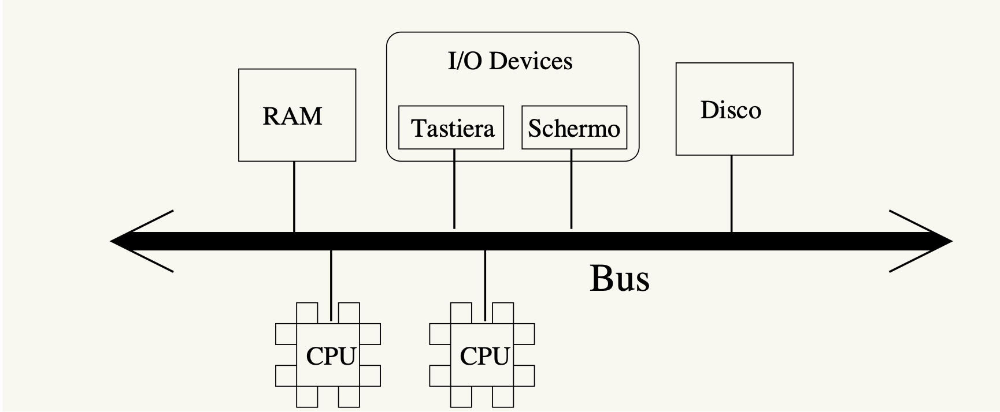
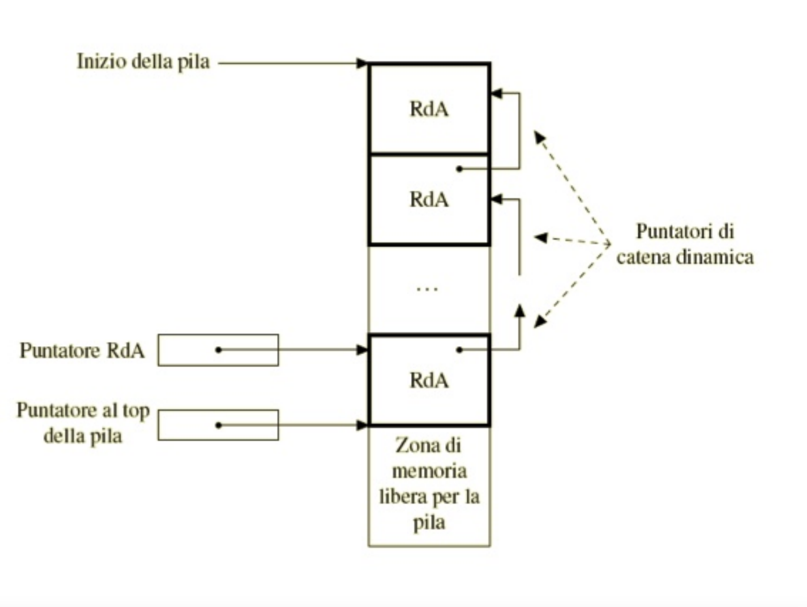

<h2 style="margin-bottom: 0px; text-align: center"> Appunti di teoria di programmazione funzionale</h2>

<h4 style="margin-bottom: 30px; text-align: center">Torriglia Nicolas</h4>


### Premessa
Pdf utile allo studio, molto probabilmente completo, ma è preferibile affiancare il Gabbrielli Martini, Linguaggi di porgrammazione. Questo pdf è una traduzione approfondita delle slides di kuper

### 1 Introduzione alle macchine


#### 1.1 Abstract machines
Un computer è composto almeno dalle seguent componenti:
- un processore (CPU), il quale **esegue** le instruzioni macchina e per farlo **accede alla memoria** per caricare e recuperare dati.
- Una memoria principale (RAM), nella quale vengono salvati dati e programmi (lista di istruzioni). E' veloce ma volatile.
- Memoria di massa, più lenta della RAM, ma persistente
- Periferiche di I/O

#### 1.2 Architettura
Le diverse componenti del computer sono collegate tramite il **bus**, composto da una serie di connessioni elettriche. Trasmette, inoltre, istruzioni macchina tra CPU e RAM e i dati salvati nella memoria di massa.

#### 1.3 Macchina di Von Neumann
L'architettura di Von Neumann è una tipologia di architettura hardware per computer digitali programmabili a programma memorizzato la quale condivide i dati del programma e le istruzioni del programma nello stesso spazio di memoria.


<br><br>

Lo schema si basa su cinque componenti fondamentali:

1. **Unità centrale di elaborazione (CPU)**, che si divide a sua volta in unità aritmetica e logica (ALU o unità di calcolo) e unità di controllo;
2. **Unità di memoria**, intesa come memoria di lavoro o memoria principale (RAM, Random Access Memory);
3. **Unità di input**, tramite la quale i dati vengono inseriti nel calcolatore per essere elaborati;
4. **Unità di output**, necessaria affinché i dati elaborati possano essere restituiti all'operatore;
5. **Bus**, un canale che collega tutti i componenti fra loro.

#### 1.4 Il processore
Il processore ottiene le istruzioni dalla memoria e le esegue. Durante l'esecuzione di un'istruzione può essere necessario accedere alla memoria per scrivere o ottenere dati. Il processore è composto da due parti:
- parte di controllo, la quale ottiene ed esegue le istruzioni.
- Parte operativa, detta anche Arithmetic Logic Unit (ALU) che esegue istruzioni logiche e aritmetiche
- Nelle CPU moderne vi è anche l'FPU, Floating Point Unit che si occupa del calcolo della virgola mobile.

Contiene, inoltre, dei **registri** i quali possono essere visibili o invisibili al programmatore.

#### 1.5 I registri
I registri sono di due tipi:
- **invisibili** ovvero non accessibili direttamente dalle istruzioni. Essi sono **Address Register (AR)**, ovvero l'indirizzo per accedere al bus e il **Data Register (DR)** dati da leggere e scrivere
- **visibili** accessibili dalle istruzioni macchina e sono:
  - **Program Counter**, indirizzo dell'istruzione macchina successiva a execute (chiamato anche **Instruction Pointer** IP)
  - **Status Register** (SR): flag che descrivono il risultato di un'operazione dell'ALU e lo stato della macchina (detta anche F, per Flag Register)
  - Diversi registri per dati e indirizzi

#### 1.6 Esecuzione di istruzioni
I passaggi sono i seguenti:
- 1 **Fetch**, leggo l'istruzione che dev'essere eseguita. I passaggi sono i seguenti:
  - Copia il Program Counter nell'Address Register
  - Trasferimento del dato in memoria corrispondente all'AR dalla RAM al Data Register
  - Salvo il DR in un regiatro invisibile
  - Incermento il PC
- 2 **Decode**, decodifica dell'istruzione
- 3 **Execute**, esecuzione dell'istruzione. Se necessario:
  - salvo dati in memoria
  - leggo dati dalla memoria
  - modifico il PC (instruzioni salto)

#### 1.7 Memoria principale
Nel modello di Von Neumann, istruzioni e dati sono contanuti entrambi nella memoria. Si accede tramite il bus ed è costituita da celle di grandezza di 8 bit. L'accesso avviene tramite i seguenti passaggi:
1. Carica l'indirizzo al quale bisogna accedere nell'AR
2. In caso di operazioni di scrittura, si salva il dato da scrivere nel DR
3. Viene inviato il segnale tramite il bus
4. In caso di lettura, il risultato viene salvato nel DR

#### 1.8 Physical Machine and Abstract Machine
Le Physical Machines sono la concretizzazione delle Abstract Machines. Nelle abstract machines:
- $M_L$ è un'abstract machine che capisce ed esegue un linguaggio $L$.
- $L$ è il linguaggio macchina per $M_L$
- programma A: A è una lista di istruzioni $L$

*$M_L$ è un modo di descrivere $L$*

#### 1.8 Implementazione di un linguaggio

Esiste un solo linguaggio macchina per macchina astratta, ma un linguaggio può essere compreso da diverse macchine, ma può cambiare la sua implementazione. Implementare un linguaggio $L$ significa realizzare una macchina astratta $M_L$ che può eseguire un programma scritto in $L$.

Il software esegue su un Host Machine $MO_{LO}$ (con linguaggio macchina $LO$) tramite due approcci:
- interpretato, ovvero un programma scritto in $LO$ che capisce ed esegue il linguaggio $L$
- compilato, un programma che può tradurre altri programmi da $L$ a $LO$
- versione ibrida, il programma viene tradotto in un linguaggio intermedio $LI$, interpretato poi da un programma $MO_{LO}$ scritto il $LI$ (bytecode, ...).

#### 1.9 Linker e loader

I compilers non sempre compilano completamente un programma. Per efficienza alcune parti del programma sono compilate separatamente (ad esempio le librerie). I **linker** collegano le varie componenti. Esso può essere statico o dinamico. Rimpiazza gli indirizzi realtivi con quelli assoluti


### 2 Names and environments
*Questa parte non è semplicissima, soprattutto la parte sullo scoping styatico e dinamic. Consiglio lettura del pdf (capitolo 6). Tuttavia ciò che viene riportato qui è sufficiente per la comprensione e per l'esame*

I nomi sono sequenze di caratteri utilizzati per denotare qualcos'altro. Nei linguaggi di programmazione sono spesso identificatori (token alfanumerici)

#### 2.1 Denotable objects
Essi sono gli oggetti che possono essere associati a nomi. Vengono assegnati dal programmatore (variabili, parametri formali, tipi definiti dall'utente, labels, procedure, costanti, eccezioni, ...). Altri vengono definiti dal linguaggio (tipi primitivi, operazioni primitive). <br>
Il **Binding** è la procedura di associazione tra nome e oggetto. Il nome e l'oggetto non sono la stessa cosa. Il primo è solo una stringa di caratteri, mentre il secondo può essere complesso (funzione, tipo etc). Un nome può identificare più oggetti.

#### 2.2 Binding
Quando avviene?
- Con le parole chiave di un linguaggio
- Scrittura del programma, ovvero quando l'associazione nome-oggetto viene fatta nel programma, ma ha effettivamente luogo solo quando la variabile è allocata in memoria.
- In compilazione, ad esempio per le variabili di dimensioni nota a priori
- Runtime, tutte le associazioni non fatte prima avvengono in questa fase.

Statico o dinamico?
- Statico quando tutto avviene prima dell'esecuzione
- Dinamico se avviene durante l'esecuzione

 Basta pensare all'allocazione statica e dinamica. La prima avviene staticamente, la seconda dinamicamente :*

#### 2.3 Environments
Esso rappresenta l'insieme delle associazioni tra nomi e denotable objects che esistono runtime in un certo punto dell'esecuzione. La **dichiarazione** è un meccanismo, implicito o esplicito, che crea un'associazione in un environment.

Inoltre è possibile il fenomeno dell'**aliasing**, ovvero due nomi che si riferiscono allo stesso oggetto:
```c
int *X, *Y;
*X = 5;
Y = X ; // Y points to the same object as X
```

#### 2.4 Blocchi

Nei moderni linguaggi di programmazione l'environment è *strutturato*. Un **blocco** è una sezione di un programma delimitata da simboli di apertura e chiusure che contiene dichiarazioni *locali* per questa determinata regione:
- Algol, Pascal `begin end`
- Java, c `{...}`
- Lisp `(...)`
- ML `let in end`
- Altri casi:
  - Anonimo (o inline)
  - Associato ad una procedura

Vi sono diverse ragioni per utilizzare i blocchi. Ad esempio per comodità di visibilità di variabili, chiarezza, migliore utilizzo della memoria, ricorsione.

L'utilizzo dei blocchi introduce il concetto di **nesting**. Una dichiarazione locale è visibile nel blocco in cui si trova e in tutti quelli contenuti dal blocco stesso (nested) fino al momento in cui non viene dichiarata un'altra variabile con lo stesso nome, questo nasconde o maschera la dichiarazione precedente.


#### 2.5 Suddivisione dell'environment
L'environment in uno specifico blocco può essere suddiviso in:
- **local environment**, che comprende le associazioni effettuate all'interno del blocco locale
- **non local environment**, ovvero le associazioni che vengono ereditate da altre blocchi
- **global environment**, l'environment che comprende tutte le associazioni visibili in tutti i blocchi

Un'associazione creata quando si entra in un blocco locale (naming), può essere utilizzata (referecing) all'interno del blocco. Eventualmente può disattivare un'associazione effettuata precedentemente in un blocco "padre" che viene riattivata quando si esce dal blocco locale e l'associazione viene distrutta. Dunque le operazioni effettuabili sui denotable objects sono:
- Creazione
- Accesso
- Modifica (se l'oggetto è modificabile)
- Distruzione

*Nota: la creazione e distruzione di un oggetto non sono la stessa cosa della distruzione e creazione dell'associazione*

Eventi fondamentali:
1. Creazione di un oggetto
2. Creazione di un'associazione per l'oggetto
3. Reference ad un oggetto tramite associazione
4. Disattivazione di un'associazione
5. Riattivazione di un'associazione
6. Distruzione di un'associazione
7. Distruzione di un oggetto

*Note: da 1 a 7 si tratta della lifetime di un oggetto* <br>
*Note: da 2 a 6 si tratta della lifetime di un'associazione*


#### 2.6 Lifetime
La liftime di un oggetto non corrisponde con quella di un'associazione con il determinato oggetto. Infatti può essere più **lunga**. <br>
Ad esempio quando un oggetto viene passato ad una funzione come parametro. In questo caso l'oggetto esiste prima di entrare nella funzione e dopo, ma l'associazione locale dell'oggetto ha durata limitata: inizia dopo la creazione dell'oggetto e finisce prima della distruzione dell'oggetto

Tuttavia esistono dei casi in cui la liftime di un oggetto può essere più **corta** di quella di un'associazione. Basti pensare all'allocazione dinamica:

```c++
int *X, *Y;
X = (int *) malloc (sizeof(int));
Y=X;
free(X);
X=null;
```

Dopo il comando `free()`, l'oggetto smette di esistere. Tuttavia, continua ad esserci una *dangling reference* da parte di Y.

*Dangling reference: puntatore perdente, ovvero un puntatore che si riferisce ad un'area di memoria non più valida*

#### 2.7 Scope
Come possiamo interpretare le regole di visibilità? <br>
Una dichiarazione locale in un blocco è visibile nel blocco e in tutti quelli *nested*, almeno finché una dichiarazione con lo stesso nome non nasconde la precedente.

Lo scoping inteso come ricerca dell'oggetto denominato da un nome può essere di due tipi: **statico e dinamico**.

Nella maggior parte dei linguaggi moderni si utilizza lo scoping statico. Esso viene anche definito lessical scoping. In questa tipologia di scoping una varibile fa sempre riferimento all'environment superiore. Questa è una proprietà del testo del programma e non è collegata allo stack di chiamate runtime. <br>
Lo scoping statico rende anche molto più semplice creare un codice modulare poiché un programmatore può capire l'ambito semplicemente guardando il codice. Al contrario, il dinamic scoping richiede al programmatore di anticipare tutti i possibili contesti dinamici.

Esempio di static scoping:
```c
#include<stdio.h>
int x = 10;

// Chaiamta da g()
int f()
{
   return x;
}

// g() ha la sua varibile
// di nome x e chiama f()
int g()
{
   int x = 20;
   return f();
}

int main()
{
  printf("%d", g());      // l'output sarà 10
  printf("\n");
  return 0;
}
```

Con lo **scoping dinamico** un identificatore globale si riferisce all'identificatore associato all'ambiente più recente ed è raro nei linguaggi moderni. Consideriamo il seguente pseudocodice come programma scritto in un linguaggio che supporta il dynamic scoping (stesso programma di prima):
```c
int x = 10;

int f()
{
   return x;
}

int g()
{
   int x = 20;
   return f();
}

main()
{
  printf(g());
}
```
Il risultato sarà 20. Questo è dovuto al fatto che l'associazione più recente diventa "la prioritaria". Quando, all'interno di g() viene chiamato f(), viene prima creata una nuova associazione ad x che nello dynimac scoping continua ad esistere in f() nonostante la variabile gloable. <br>
Il motivo è perché ogni volta che viene chiamata ed eseguita una nuova funzione, il suo scope viene aggiunto allo stack degli scope e sovrascrive gli scope precedenti fino alla fine della sua esecuzione, quando il suo scope viene rimosso dallo stack.

*Definizione da Gabbrielli Martini: <br>Secondo la regola dello scope dinamico, l'associazione valida per un nome X, in un qualsiasi punto P di un programma, è la più recente (in senso temporale) associazione creata per X che sia ancora attiva quando il flusso di esecuzione arriva a P.*

Alcuni vantaggi dello static scoping sono:
- miglior lettura e facilità di scrittura del codice;
- maggior efficienza
- utilizzato nella maggioranza dei linguaggi

Nel dynamic scoping:
- difficoltà di lettura del programma
- difficile da implementare e meno efficiente
- utilizzato da pochi linguaggi e sempre affiancato dallo scoping statico.

Da notare che lo scoping dinamico non interferisce con lo scoping per annidamento. Tuttvia "riscrive le regole" in maniera dinamica. Resta di fatto che lo scoping dinamico è vantaggioso in rarissimi casi e viene utilizzato molto pochi in alcune versioni di alcuni linguaggi. Ma quindi quando è vantaggioso?

Proviamo a pensare da una funzione `visualizza(testo)` che ha lo scopo di stampare il `testo` in un colore definito da una variabile non locale definita a nero. Se la maggior parte delle stampe è nera è un vantaggio limitare il passaggio di parametri inutili. Così se vogliamo effettuare una stampa di un colore diverso basterà assegnare a `colore` il valore desiderato prima di chiamare la funzione `visualizza`

*Molto consigliati gli esercizi a fine capitolo*

### 3 Gestione della memoria
Capitolo 7 Gabbrielli

La memoria viene gestita in diversi modi:
- statica, allocata al momento dell'allocazione
- dinamica, allocata al momento dell'esecuzione e si divide in:
  - Stack, oggetti allocati in LIFO
  - Heap, gli oggetti possono essere allocati e deallocati in qualsiasi momento

#### 3.1 Allocazione statica
In questa modalità di allocazione, tutti gli oggetti vengono allocati al momento della compilazione. Ogni oggetto ha un indirizzo assoluto che viene mantenuto durante l'esecuzione. <br>
Normalmente vengono allocati staticamente:
- variabili globali;
- variabili locali di subprogrammi, a meno di ricorsione
- costanti
- tabelle usate runtime (ad esempio per il type check o per il garbage collector)

Nel caso in cui il linguaggio di programmazione non supporti la ricorsione è possibile gestire anche gli altri elementi staticamente. Ad esempio le subroutine (procedure allocate staticamente), hanno la seguente struttura in memoria:
- informazioni di sistema
- indirizzo di ritorno
- parametri
- variabili locali
- risultati intermedi

E' facile notare come la stessa procedura chiamata due volte nel corso dell'esecuzione condivide la stessa zona di memoria il che è corretto in quanto non vi possono essere due chiamate attive alla stessa funzione contemporaneamente senza ricorsione.

#### 3.2 Gestione dinamica mediante pila
Nell'allocazione dinamica tramite stack, abbiamo l'attivazione di un record o frame che contiene le informazioni della sua istanza. Dunque ogni blocco, sia esso inline ({...}) o una funzione viene aperto e chiuso usano la politica LIFO. Consideriamo la seguente struttura:
```c
A:{
  int a = 1;
  int b = O;

  B:{
    int c = 3;
    int b = 3;
  }
  b = a+l;
}
```

Quando si entra nel blocco A e poi nel B, per uscire da A è necessario prima uscire da B.

Quello che succede nel momento dell'esecuzione è che bisogna allocare sulla pila le variabili a e b. Lo stesso lo si fa per le variabili c e b del blocco B. All'uscita dei rispettivi blocchi si fa, invece, un'operazione di pop. Il record o frame è lo spazio allocato per ogni blocco inline o attivazione di procedura. <br>
E' evidente che con questo metodo di allocazione è possibile attivare la stessa funzione più volte contemporaneamente in quanto ad ogni attivazione è associato un frame differente, permettendo, dunque, la ricorsione.

#### 3.3 Record per i blocchi inline
Il record per il blocchi inline (definiti da parentesi, begin end etc.) sono:
- puntatore di catena dinamica
- varibili locali
- risultati intermedi

I **risultati intermedi** possono essere necessari per memorizzare il risultato di alcuni calcoli senza che gli si venga assegnato un nome specifico. Ad esempio per il programma:
```c
{
  int a = 3;
  b = (a+x) / (x+y);
}
```
i risultati di intermedi di `(a+x)` e `(x+y)`. La necessità di questo passaggio intermedio è strettamente legato al compilatore.

Le **variabili locali** hanno solitamente dimensione fissa, tuttavia esistono dei casi in cui le non si conosce a priori la dimensione delle varibili (allocazione dinamca di array ad esempio). In questi casi il record prevede anche una parte di dimensione variabile che sarà definita in esecuzione.

Il **puntatore di catena dinamica** serve per memorizzare il record precedente. E' necessario perché i record hanno spesso dimensioni differenti (e non sono conitgui (da verificare)).

#### 3.4 Record delle procedure
L'allocazione delle procedure è analogo a quello dei blocchi inline, leggermente più complesso in quanto è maggiore la quantità di dati da memorizzare. La struttura p la seguente:
- Puntatore dì Catena Dinamica
- Puntatore di Catena Statica
- Indirizzo di Ritorno
- Indirizzo del Risultato
- Parametri
- Variabili locali
- Risultati Intermedi

Per quanto riguarda **risultati intermedi, variabili locali, puntatore di catena dinamica**, non vi è alcuna differenza dall'allocazione dei blocchi inline. <br>
Il **puntatore di catena statica** serve per gestire le informazioni necessarie a realizzare le regole di scope statico. <br>
L'**indirizzo di ritorno** contiene l'indirizzo della prima istruzione da eseguire dopo che la chiamata di procedura/funzione attuale ha terminato l'esecuzione. <br>
L'**indirizzo del risultato**, presente solo nel caso delle funzioni, contiene l'indirizzo della locazione di memoria nella quale il sottoprogramma deposita il valore restituito dalla funzione, quando questa termina. <br>
I **parametri** sono i valori attuali usati nella chiamata della procedura o funzione.

#### 3.5 Gestione della pila



Nella precedente immagine vediamo il funzionamento della pila. <br>
*La pila cresce verso il basso.*

Un puntatore esterno punta all'ultimo record *o frame* inserito nello stack. Questo puntatore viene anche chiamatp **frame pointer** o puntatore all'ambiente corrente. Esso corrisponde al Puntatore RdA (Record di Attivazione) nell'immagine.

Vi è anche un altro puntatore nella foto. Si tratta del Puntatore al top della pila. Esso indica la prima posizione di memoria libera nella pila. Si tratta dello **stack pointer**. Tuttavia, questo puntatore può essere omesso se il frame pointer punta sempre ad una posizione di distanza prefissata dall'inizio della parte libera della pila.

#### 3.6 Gestione della memoria dinamica tramite heap

Nel caso in cui il linguaggio di programmazione preveda comandi espliciti per l'allocazione della memoria, lo stack non è più sufficiente. Si utilizza l'**heap**. Si tratta di una zona in memoria dove il programma può allocare e deallocare memoria arbitrariamente. In questo caso essendoci parecchia libertà non è possibile gestire la meoria in modalità LIFO.

Esistono due tipi di blocchi allocabili:
- quelli a dimensione fissa
- quelli a dimensione variabile

#### 3.7 Heap con blocchi a dimensione fissa

In questo caso l'heap è suddiviso in blocchi o elementi di dimensione fissa collegati ad una lista. Si tratta, in pratica, di una lista di elementi "liberi", ovvero allocabili. Infatti, quando a runtime viene trovato ad esempio il comando `malloc`, il primo elemento della lista viene rimosso dalla lista e viene restituito il puntatore a tale elemento. Inoltre, viene aggiornato il puntatore al primo elemento libero, che verrà restituito in una successiva malloc.

Quando una zona viene deallocata o liberata, quell'elemento ormai libero viene riaggiunto alla lista degli elementi liberi.

Ovviamente, essendo questo tipo di memoria non prevedibile e non gestibile in LIFO, la lista di elementi liberi sarà scollegata andando avanti, assumendo una conformazione simile a quella delle linked list.

#### 3.8 Heap con blocchi a dimensione variabile

Nel caso in cui un linguaggio permetta l'allocazione dinamica di elementi a dimensione variabili, come gli *array* di dimensione variabile, non è più possibile utilizzare blocchi a dimensione fissa. Introduciamo i blochi variabili. In questo modo migliora la gestione della memoria, ma si rallenta l'esecuzione.

Uno tra i principali problemi da evitare è quello della *frammentazione* della memoria. <br>
La **frammentazione interna** si ha quando viene allocato un blocco strettamente maggiore del necessario. La porzione del blocco non utilizzata non sarà utilizzabile fino a che non verrà liberato l'intero blocco. <br>
Tuttavia il problema più grande si ha con la **frammentazione esterna**, ovvero quando la somma della memoria libera nell'heap è più piccola di quella che viene richiesta dal programma. Per evitare quesot problema, nella maggior parte dei casi si tende a compattare la memoria libera, unendo i blocchi contigui. Questo processo rallenta molto l'esecuzione.

Esistono due tecniche di gestione:

##### Unica lista libera

La prima tecnica di gestione dell'heap con blocchi a dimensione è quella di utilizzare un'unica lista, costituita da un blocco contenente l'intero heap. Ora ha, infatti, senso mantenere i blocchi della dimensione più grande possibile: non ha dunque senso suddividere la memoria in tanti piccoli blocchi come nel caso dei blocchi a dimensione fissa.

Quando viene richiesta l'allocazione di un blocco di $n$ parole in memoria, le prime $n$ parole sono allocate e il puntatore all'inizio dell'heap avanza di $n$. Analogamente per le richieste di allocamento successive.

Quando avviene una deallocazione, la memoria liberata viene collegata ad una lista libera, non utilizzabile direttamente da nuove allocazioni.

Quando si raggiunge la fine dell'heap bisogna utilizzare lo spazio di memoria deallocato. Per farlo esistono due metodi:
- Utilizzo diretto della lista libera: la lista libera di blocchi variabili viene mantenuta. Quando si necessita di un blocco di n parole, si ricerca nella lista di blocchi un blocco grande k>n. Se k-n è molto grande (maggiore di una soglia prefissata) si crea un nuovo blocco da inserire in lista. Altrimenti è ammissibile la frammentazione interna. <br> <br>
Per la ricerca del blocco vi sono due politiche:
  - *best fit*, ovvero ricerca del blocco dove k-n è inferiore possibile. Lento, ma buona gestione di memoria
  - *first fit*, il primo blocco dove k>n. Più veloce, ma peggior gestione
  - se la lista dei blocchi liberi è ordinata, le due modalità appena descritte coincidono.

- Compattazione della memoria libera. Con questa tecnica, quando si raggiunge la fine dell'heap, tutti i blocchi allocati vengono spostati all'inizio dell'heap, lasciando la memoria libera in un unico blocco. A questo punto si aggiorna il puntatore all'heap. Questo metodo non è sempre attuabile, in quanto ci possono essere dei casi in cui i blocchi non sono spostabili.


##### Liste libere multiple
In questo metodo le liste sono più di una e ogni lista contiene blocchi della stessa dimensione. Quando viene richiesto un blocco di dimensione n, si cerca la lista contenente blocchi di dimensione $\geq$ n. Anche in questo caso le dimensioni dei blocchi possono essere statiche o dinamiche. Per quelle dinamiche abbiamo due metodi:
  - buddy system: se viene richiesto un blocco di dimensione n, k è il più piccolo intero tale che $2^k \geq n$. Quindi si cerca nella lista dei blocchi $2^k$ un blocco libero. Se non trovato si cerca nella lista dei blocchi $2^{k+1}$ e si divide in due, uno viene allocato, l'altro inserito nella lista dei blocchi $2^k$. Se si dealloca la metà allocata, si cerca il suo compagno o buddy, ovvero l'altra metà "declassata". Se libera si riuniscono nel blocco $2^{n+1}$
  - Fibonacci heap: funziona in maniera simile, ma invece che usare le potenze di due si usano le successioni di fibonacci come grandezza dei blocchi delle varie liste. Essendo che la successione di Fibonacci cresce più lentamente si ha meno frammentazione interna.


#### 3.9 Implementazione delle regole di scope
